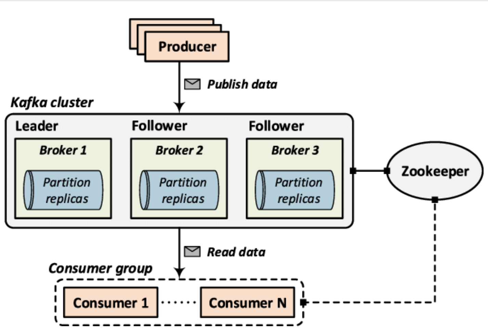

# Demo Red Hat AMQ Streams on OpenShift

Voici un tutotial sur ce qu'est [REd Hat AMQ streams](https://www.redhat.com/en/resources/amq-streams-datasheet)


## Red Hat AMQ Streams, Apache Kafka sur Red Hat Openshift.

Le composant `Red Hat AMQ streams`est une plate-forme de flux de données massivement évolutive, distribuée et hautes performances basée sur le projet [Apache Kafka](https://kafka.apache.org/). Il offre une infrastructure distribuée qui permet aux microservices et à d'autres applications de partager des données avec un débit élevé et une faible latence.


__Apache Kafka__ est une plateforme de streaming d'événements distribués open source utilisée par des milliers d'entreprises pour les pipelines de données hautes performances, l'analyse de streaming, l'intégration de données et les applications critiques.

### Even-driven architecture

Les architectures événementielles et les modèles de programmation réactive ne sont pas des idées nouvelles. Mais, dans les architectures Cloud-Native avec des microservices, des charges de travail basées sur des conteneurs et le serverless, nous permets de revoir les approches pilotées par les événements dans le contexte Cloud-native.


2 phases sont nécessaire pour le development d'un architecture évènementielles
* Des microservices pour implémentent l'architecture d'application faiblement couplée qui permet un déploiement dans des modèles hautement distribués pour plus de flexibilité, d'agilité et d'évolutivité.
* Une plates-formes cloud natives avec conteneurs et déploiements serverless. Une late-forme d'application et des outils qui réalisent la flexibilité, l'agilité et l'évolutivité de l'architecture de microservices.


1. __Publish/Subscribe (_Pub/Sub_) Messaging.__
Pub/Sub est une forme de communication service à service asynchrone utilisée dans les microservices et les architectures serverless. Lors de la publication ou de la génération d'un événement, il envoie le message à chaque abonné. Un massage ne se répète pas après sa réception et les nouveaux abonnés ne voient pas l'événement. Les abonnés n'ont pas besoin de savoir quoi que ce soit sur les éditeurs, et vice-versa autre que l'éditeur est un éditeur légitime et l'abonné autorisé est de recevoir des informations.

1. __Event Source__
La source d'événements envoie des événements au système de traitement d'événements. Ces sources peuvent être une ou plusieurs pouvant envoyer un événement à un ou plusieurs processeurs d'événements.


### Table des matière
* [Prérequis](#prérequis)
* [Intasllation de Kafka](#installation)
* [Commande intéressante](#commande)
* [Architecture](#architecture)
* [Demo Producer et Consumer](docs/demo-consumer-producer.md)
* [Demo Kafka Streams](docs/demo-kafka-streams.md)

##### Prérequis
* Un cluster OpenShift
* Un compte admin
* Un acces au cluster par CLI
* Accès au code de ce repository


#### Installation

L'installation de l'opérateur Kafka, le cluster et le topic ce fait en exécutant le scrtip kustomize suivant.
    ```
    oc apply -k setup/overlays/demo
    ```


#### Commande
Kafka est juste un resource dans le cluster, on peut donc les décrire avec différente commande tels que.

* List les crds
 > oc get crds | grep kafka
* Voir les pods qui se font créer. ( 3 kafka, 3 zookeeper, 1 operator )
> oc get pods -n mykafka -w 
* Trouvez les service, fonc le bootstrap
> oc get services -n mykafka


#### Architecture 

`Kafka` est un système de publication/subcription distribué robuste. Il agit comme une file d'attente de messages, mais il offre deux avantages majeurs par rapport aux systèmes pub/sub traditionnels.
* Stockage des enregistrements avec Fault Tolerance.
* Traitement des flux (flux de données) au fur et à mesure qu'ils se produisent en temps réel plutôt que par lots

`Kafka broker`permet aux consommateurs de récupérer des messages par sujet, partition et décalage. Les courtiers Kafka peuvent créer un cluster Kafka en partageant des informations entre eux directement ou indirectement à l'aide de Zookeeper. Un cluster Kafka a exactement un courtier qui agit en tant que contrôleur.

`Zookeeper` est principalement utilisé pour suivre l'état des nœuds dans le cluster Kafka et maintenir une liste de sujets et de messages Kafka.

`Partition` prend le journal d'un topic unique et le divise en plusieurs journaux, chacun pouvant résider sur un nœud distinct du cluster Kafka. De cette façon, le travail de stockage des messages, d'écriture de nouveaux messages et de traitement des messages existants peut être réparti entre plusieurs nœuds du cluster. 

`Topic` sont les catégories utilisées pour organiser les messages. Chaque topic porte un nom unique sur l'ensemble du cluster Kafka. Les messages sont envoyés et lus à partir d'un topic spécifiques. En d'autres termes, les producteurs écrivent des données dans un topic et les consommateurs lisent des données à partir de ce topic.

`Message` est une paire clé/valeur stockée dans un topic. Ce message est persistant et durable pendant la durée de vie configurée. Un message est un petit morceau de données typique avec deux parties la clé (facultative) pour identifier le message et il est utilisé par défaut pour décider dans quelle partition le message est stocké, et la valeur qui est le contenu du message qui peut être dans n'importe quel format.

`Producer` publie des messages dans un topic à la fin d'une partition. Par défaut, si un message contient une clé, la valeur hachée de la clé est utilisée pour décider dans quelle partition le message est stocké. Si la clé est nulle, un algorithme circulaire est utilisé pour équilibrer les messages sur toutes les partitions.

`Consumer` Chaque message publié dans une topic est remis à un consommateur abonné à ce topic. Un consommateur peut lire des données à partir de n'importe quelle position de la partition et, en interne, elles sont stockées sous la forme d'un pointeur appelé décalage. Dans la plupart des cas, un consommateur avance son décalage de manière linéaire, mais cela peut être dans n'importe quel ordre, ou à partir de n'importe quelle position donnée

