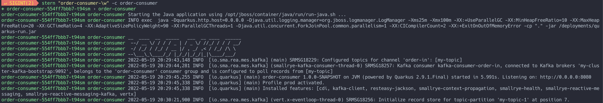

# Démonstration Producer/Consumer


## Déploiement du Producer

* Déploiement de l'application
    ```
    oc apply -f manifest/k8s/producer/deployment.yaml
    ```
* Création du service
    ``` 
    oc apply -f manifest/k8s/producer/service.yaml
    ```
* Nous devons exposer le service producer pour pouvoir l'accéder de l'extérieur
    ``` 
    oc expose svc order-producer
    ```

* Récupérons URL  de la route dans une variable
    ``` 
    export PRODUCER_URL=$(oc get route order-producer -n mykafka -o=jsonpath="{.spec.host}")
    ```

* Test
    ``` 
    curl $PRODUCER_URL/health
    ```

    Résultat
    ```
    200
    ```

* Accédons les logs
    ``` 
    stern "order-producer-\w" -c order-producer
    ```
___

## Déploiement du Consumer

* Déploiement de l'application
    ```
    oc apply -f manifest/k8s/consumer/deployment.yaml
    ```
* Création du service
    ``` 
    oc apply -f manifest/k8s/consumer/service.yaml
    ```

* Accédons les logs
    ``` 
    stern "order-consumer-\w" -c order-consumer
    ```
___


## Test

1. Ouvrir un terminal connecté à OpenShift et accéder aux logs de order-consumer
    ``` 
        stern "order-consumer-\w" -c order-consumer
    ```

    

2. Dans un autre terminal envoyez un curl au producer
    ```
        curl --header "Content-Type: application/json" \
        --request POST \
        --data '{"name":"Jack Frost", "value":"300"}' \
        $PRODUCER_URL
    ```

    Résultat: Un entré devrait apparaitre dans le log du consumer
    ```
    order-consumer-554ff7bbb7-t94sm order-consumer 2022-05-19 20:30:21,922 INFO  [com.the.dem.kaf.OrderConsumer] (vert.x-eventloop-thread-0) Got an order for: Jack Frost for 100$
    ```
---

:construction: __CLEAN UP__
```
./scripts/cleanup-demo1.sh
```
