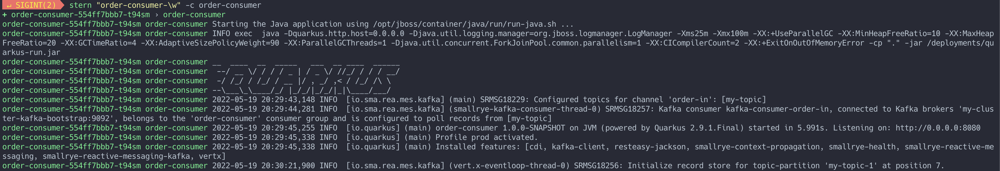

# Démonstration Kafka Streams


## Création des topics Kafka requis


## Déploiement du player-app

* Créer le topic Kafka
    ```
    oc create -f manifest/kafka/songs.yaml
    ```

* Déploiement de l'application
    ```
    oc apply -f manifest/k8s/player-app/deployment.yaml
    ```
* Création du service
    ``` 
    oc apply -f manifest/k8s/player-app/service.yaml
    ```


* Accédons les logs
    ``` 
    stern "player-app-\w" -c player-app
    ```

    Résultat: on devrait voir les chansons défiler.

___

## Déploiement du music-chart-app

* Créer le topic Kafka
    ```
    oc create -f manifest/kafka/played-songs.yaml
    ```


* Déploiement de l'application
    ```
    oc apply -f manifest/k8s/music-chart-app/deployment.yaml
    ```
* Création du service
    ``` 
    oc apply -f manifest/k8s/music-chart-app/service.yaml
    ```


* Accédons les logs
    ``` 
    stern "music-chart-app-\w" -c music-chart-app
    ```

    Résultat: on devrait voir l'agggregation des chansons qui ont joué
___


## Test

1. Ouvrir un terminal connecter a OpenShift et accéder au logs du player-app
    ``` 
    stern "player-app-\w" -c player-app
    ```

    

1. Ouvrir un terminal connecter a OpenShift et accéder au logs du music-chart-app
    ``` 
    stern "music-chart-app-\w" -c music-chart-app
    ```

    Resultat: Pour chaque chansons jouer du coté player-app l'aggregation du côté de music-chart-app devrait monter.
---

:construction: __CLEAN UP__
```
./scripts/cleanup-demo2.sh
```
